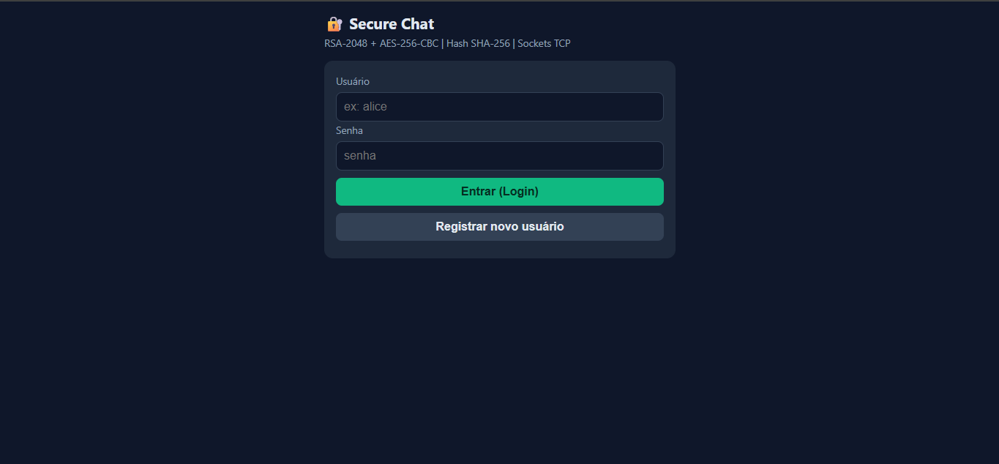
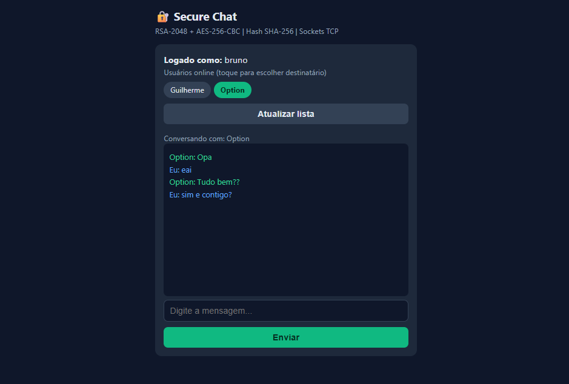

# Secure Chat — Sistema de Mensagens Seguras

Projeto final da disciplina **Segurança da Informação** (Capítulo 3 — Criptografia).
Aplicativo de mensagens em rede que demonstra, na prática, criptografia híbrida
(RSA + AES), autenticação com hash de senhas e comunicação via sockets TCP em Python.

## Link Vídeo demonstrativo:
- https://youtu.be/kBkXOYtLbiE

## Desenvolvedores
- Guilherme alves Da Silva
- Igor Silva

## Conceitos aplicados

- **Criptografia simétrica (AES-256-CBC)** — cifra o conteúdo das mensagens.
- **Criptografia assimétrica (RSA-2048, padding OAEP)** — protege a chave AES em trânsito.
- **Função hash (SHA-256 via PBKDF2 + salt)** — armazenamento seguro de senhas.
- **Sockets TCP/IP** — comunicação cliente-servidor.
- **Criptografia híbrida** — combinação de RSA (troca de chave) + AES (dados).

## Arquitetura

```
Cliente A --login/hash--> Servidor --roteamento--> Cliente B
Cliente A --chave pública RSA--> Servidor --> Cliente B (armazenada em memória)
Cliente A: gera chave AES -> cifra mensagem (AES) -> cifra chave AES (RSA pública de B)
Cliente A --mensagem cifrada + chave AES cifrada--> Servidor --roteia--> Cliente B
Cliente B: decifra chave AES (RSA privada) -> decifra mensagem (AES)
```

O servidor **nunca** vê o conteúdo das mensagens em texto claro nem as chaves
privadas dos clientes — ele apenas autentica usuários e roteia dados já
criptografados.

## Estrutura de arquivos

```
secure_chat/
├── server.py          # servidor de roteamento (autenticação + troca de chaves + roteamento de mensagens)
├── client.py           # cliente CLI (terminal)
├── client_gui.py        # cliente com interface gráfica (Tkinter)
├── web_client.py        # interface web "Secure Chat" (abre no navegador do PC; também acessível pelo celular na mesma Wi-Fi)
├── crypto_utils.py     # funções de criptografia (RSA, AES, encoding)
├── auth.py              # hash de senha (PBKDF2-SHA256 + salt) e verificação
├── database.py          # persistência simples dos usuários (users.json)
├── requirements.txt     # dependências
└── .gitignore
```

## Instalação

```bash
python -m venv venv
source venv/bin/activate      # Windows: venv\Scripts\activate
pip install -r requirements.txt
```

## Como executar

**1. Inicie o servidor** (um terminal, deixe rodando):

```bash
python server.py
```

**2. Escolha uma das três interfaces de cliente:**

### Opção A — Terminal (`client.py`)

```bash
python client.py
```
Escolha `2` para registrar um novo usuário, depois `1` para logar. Comandos:

| Comando | Descrição |
|---|---|
| `/usuarios` | Lista usuários online |
| `/falarcom <nome>` | Define o destinatário atual |
| `/sair` | Encerra o cliente |
| *(qualquer texto)* | Envia como mensagem ao destinatário atual |

### Opção B — Interface gráfica (`client_gui.py`, +5 pts de bônus)

```bash
python client_gui.py
```
Abre uma janela de login/registro; após autenticar, abre a janela de chat com
lista de usuários online à esquerda e conversa à direita.

### Opção C — Interface web "Secure Chat" (`web_client.py`)

```bash
python web_client.py
```
Sobe uma página web e **abre automaticamente no navegador do PC**
(`http://127.0.0.1:8080`). A mesma página também pode ser acessada de outro
dispositivo (celular, outro PC) **na mesma rede Wi-Fi**: descubra o IP do PC
(`ipconfig` no Windows, procure "Endereço IPv4" da Wi-Fi) e acesse pelo
navegador do outro aparelho:

```
http://<IP-DO-SEU-PC>:8080
```

A criptografia RSA/AES continua acontecendo em Python no PC — a página só
envia o texto puro pela rede local até o servidor web, que cifra/decifra e
fala com o servidor de roteamento pelo mesmo protocolo dos outros clientes.

> Você pode misturar as três interfaces livremente — por exemplo, `alice` no
> `client_gui.py` conversando com `bob` pelo navegador do celular.

## Segurança — decisões técnicas

- **Senhas**: nunca armazenadas em texto claro. Usamos `hashlib.pbkdf2_hmac`
  (SHA-256, 100.000 iterações) com salt aleatório de 16 bytes por usuário.
- **RSA**: chaves de 2048 bits, padding **OAEP** (mais seguro que PKCS#1 v1.5).
  As chaves privadas nunca saem da máquina do cliente.
- **AES**: chave de 256 bits gerada aleatoriamente **a cada mensagem** (forward
  secrecy por mensagem), modo **CBC** com IV aleatório de 16 bytes, padding PKCS7.
- **Biblioteca**: toda a criptografia usa `cryptography` (auditada), sem
  implementações caseiras de algoritmos.

## Verificando a criptografia com Wireshark

Para demonstrar que o tráfego está de fato cifrado:
1. Abra o Wireshark e filtre por `tcp.port == 5050`.
2. Envie uma mensagem entre os clientes.
3. Inspecione o payload TCP — os campos `ciphertext` e `enc_key` aparecem
   como dados binários em base64, sem texto legível.

## Autores

Projeto desenvolvido em dupla para a disciplina de Segurança da Informação — IFPI.

## Screenshots

**Tela de login:**



**Conversa entre dois usuários:**


